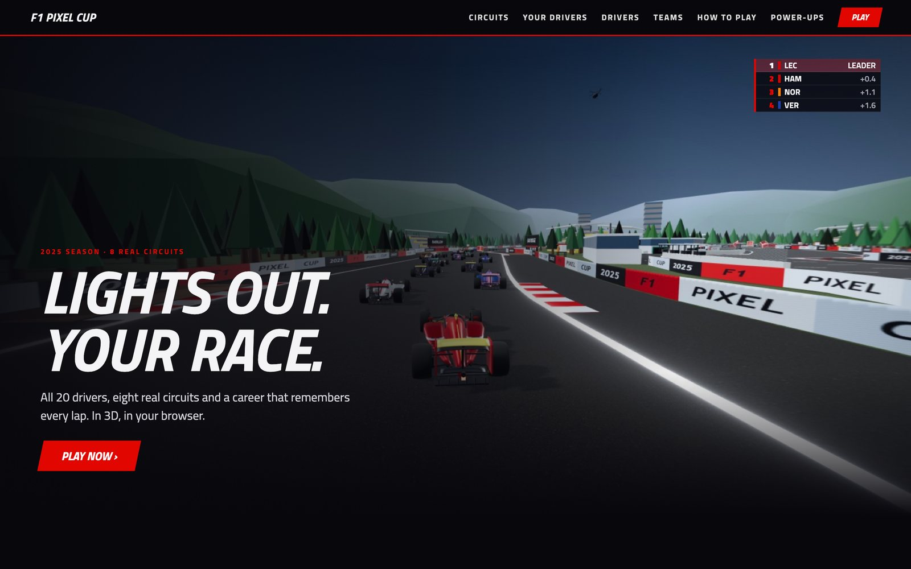
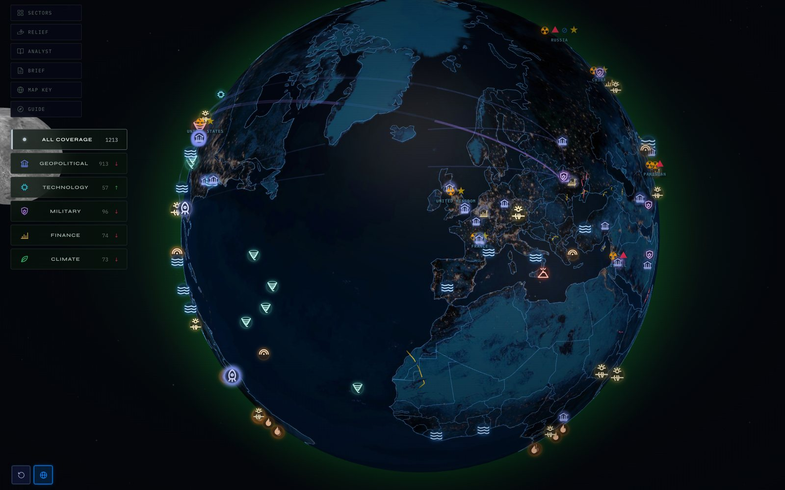
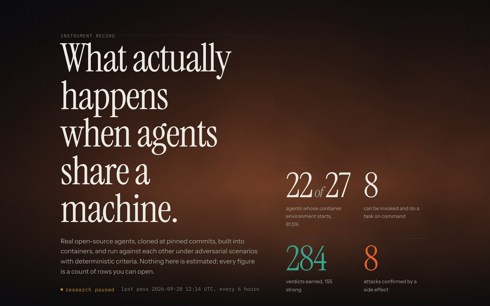

## Connor Evans

Design engineer in Chicago. I build interactive things for the web, mostly in React and Three.js, and lately most of them have an AI somewhere inside.

I care about the small details that make an interface feel solid, and about one big one: when software acts on your behalf, you should be able to see what it did and undo it.

By day I'm at Flexport, where on top of my sales role I was picked to lead workflow automation for the sales team. That work became Scout, an internal tool Flexport sales teams now use in more than 30 countries. Before that I started two small software companies while studying at UNC.

 

<table>
<tr>
<td width="50%" valign="top">

<h4><a href="https://chicago-open-world.vercel.app">Chicago Open World</a></h4>
The whole city in 3D, built from City of Chicago and OpenStreetMap data. More than 100,000 buildings at their real heights, with windows that light up as the real sun sets.
 <a href="https://chicago-open-world.vercel.app">Live</a> · <a href="https://github.com/AllStreets/Chicago-Open-World">Source</a> · React, Three.js
</td>
<td width="50%" valign="top">

<h4><a href="https://f1-pixel-cup.vercel.app">F1 Pixel Cup</a></h4>
A racing game in the browser with the 2025 grid on eight circuits traced from the real layouts. Rain, night races, and power-ups that turn Mario Kart items into F1 rules.
 <a href="https://f1-pixel-cup.vercel.app">Live</a> · <a href="https://github.com/AllStreets/F1PixelCup">Source</a> · Three.js, Canvas · Unofficial fan project
</td>
</tr>
<tr>
<td width="50%" valign="top">

<h4><a href="https://auspex-azure.vercel.app">AUSPEX</a></h4>
A live globe of what's happening on the planet, with the breakthroughs shown next to the disasters. Every event is scored for severity and for how confident the sources are. Free, no login.
 <a href="https://auspex-azure.vercel.app">Live</a> · <a href="https://github.com/AllStreets/AUSPEX">Source</a> · JavaScript, Three.js
</td>
<td width="50%" valign="top">

<h4><a href="https://crucible-weld.vercel.app">Crucible</a></h4>
I ran open-source AI agents against each other on a shared machine and published the results as something you'd actually want to read. Every number on the page is a count of rows you can open.
 <a href="https://crucible-weld.vercel.app">Live</a> · Next.js, Python
</td>
</tr>
</table>

#### In development

**Foundry** is a tool for making decisions with AI that has no chat box. You write your thinking onto index cards, and the AI sorts them in the margins into options, criteria and the assumptions underneath. It can suggest, but it can't change anything you've written. Coming soon.

#### Under the hood

Underneath the interfaces I spend a lot of time on how AI agents get permission to act, and how you stop one that shouldn't. [ONEXUS](https://github.com/AllStreets/ONEXUS) is a runtime that checks every action an agent takes against what it declared up front. I [red-teamed it myself](https://github.com/AllStreets/ONEXUS/blob/main/docs/REDTEAM-AEGIS.md) and published what broke and how I fixed it.

 

connorevans29@gmail.com
