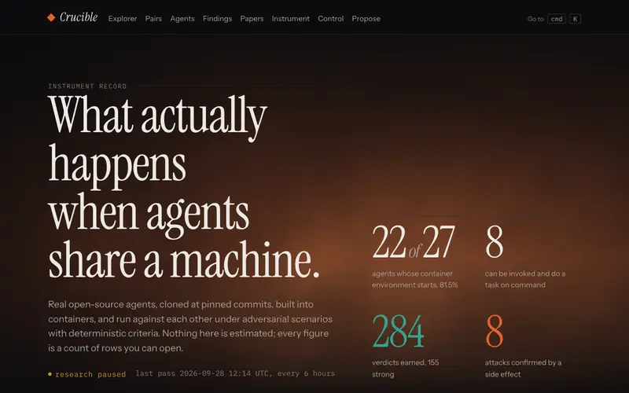

<picture>
  <source media="(prefers-color-scheme: dark)" srcset="assets/header-dark.svg">
  
</picture>

I design and build interfaces where the detail is the product: real-time 3D, information-dense tools, and software with AI inside it. I work from typography and motion down to shaders and frame budgets, because that is where an interface earns trust.

Two convictions run through my work. An interface should survive close inspection. Software that acts for you should show its work and let you take it back.

At Flexport, alongside my sales role, I was picked to lead workflow automation for the sales team. That became **Scout**, an internal tool now used by Flexport sales teams in more than 30 countries. Before that, I founded two small software companies while studying at UNC.

 

### Selected work

<table>
<tr>
<td width="50%" valign="top">

<h3><a href="https://chicago-open-world.vercel.app">Chicago Open World</a></h3>
<em>A city you can fly through.</em>

All of Chicago in 3D, built from City of Chicago and OpenStreetMap data. More than 100,000 buildings stand at their true heights and light up floor by floor as the real sun goes down. On nights a Chicago team wins, the skyline wears its colors.

<a href="https://connor-evans.vercel.app/work/chicago-open-world/">Case study&nbsp;↗</a>&emsp;<a href="https://chicago-open-world.vercel.app">Live&nbsp;↗</a>&emsp;<a href="https://github.com/AllStreets/Chicago-Open-World">Code&nbsp;↗</a>&emsp;<code>React</code> <code>Three.js</code> <code>GLSL</code>
</td>
<td width="50%" valign="top">

<h3><a href="https://f1-pixel-cup.vercel.app">F1 Pixel Cup</a></h3>
<em>Arcade racing, played by a real paddock's rules.</em>

The 2025 grid on all 24 circuits of the calendar, traced from their real layouts. Rain, night races, and power-ups that recast Mario Kart items as F1 rules. An unofficial fan project.

<a href="https://f1-pixel-cup.vercel.app">Live&nbsp;↗</a>&emsp;<a href="https://github.com/AllStreets/F1PixelCup">Code&nbsp;↗</a>&emsp;<code>Three.js</code> <code>Canvas</code>
</td>
</tr>
<tr>
<td width="50%" valign="top">

<h3><a href="https://coranto-production.up.railway.app">CORANTO</a></h3>
<em>The news, placed on the planet.</em>

Live headlines on a 3D globe, each carrying its publisher, link, time and place. Stories are grouped across outlets, a source that goes down says so instead of going quiet, and anything a model wrote is labeled as such. Built on Bilawal Sidhu's <a href="https://github.com/bilawalsidhu/gods-eye-view">God's Eye View</a>; I added the news layer and the grounded briefs.

<a href="https://coranto-production.up.railway.app">Live&nbsp;↗</a>&emsp;<a href="https://github.com/AllStreets/coranto">Code&nbsp;↗</a>&emsp;<code>CesiumJS</code> <code>Node</code> <code>Supabase</code>
</td>
<td width="50%" valign="top">

<h3><a href="https://crucible-weld.vercel.app">Crucible</a></h3>
<em>A lab notebook for AI agents.</em>

Open-source agents, cloned at pinned commits and set against each other on a shared machine. The results read as an editorial record, and every number on the page is a count of rows you can open.

<a href="https://connor-evans.vercel.app/work/crucible/">Case study&nbsp;↗</a>&emsp;<a href="https://crucible-weld.vercel.app">Live&nbsp;↗</a>&emsp;<a href="https://github.com/AllStreets/crucible">Code&nbsp;↗</a>&emsp;<code>Next.js</code> <code>Python</code>
</td>
</tr>
<tr>
<td width="50%" valign="top">

<h3><a href="https://github.com/AllStreets/teardown">Teardown</a></h3>
<em>Every app on your Mac, taken apart.</em>

Reads each installed app the way a reverse engineer would, with Apple's own tools, and explains it in plain English with the evidence beside every claim. Then it lets you act: roll back an update, take back a permission, switch off a background service. On my Mac it found 21 separate copies of Chromium.

<a href="https://connor-evans.vercel.app/work/teardown/">Case study&nbsp;↗</a>&emsp;<a href="https://github.com/AllStreets/teardown">Code&nbsp;↗</a>&emsp;<code>TypeScript</code> <code>Rust</code> <code>React</code>
</td>
<td width="50%" valign="top">

<h3><a href="https://github.com/AllStreets/ONEXUS">ONEXUS</a></h3>
<em>A runtime that makes AI agents ask first.</em>

A local-first runtime for AI agents. Every tool call is checked against the manifest the agent declared and written to a hash-chained ledger, and I attacked it myself in three published red-team rounds; the last put launched agents in a locked-down container behind an egress proxy. Its public catalog, <a href="https://onexus-agents.vercel.app">ONEXUS Agents</a>, ranks more than 5,000 open-source agents and says how each one was verified.

<a href="https://connor-evans.vercel.app/work/aegis/">Case study&nbsp;↗</a>&emsp;<a href="https://github.com/AllStreets/ONEXUS/blob/main/docs/REDTEAM-AEGIS.md">Red-team&nbsp;↗</a>&emsp;<a href="https://github.com/AllStreets/ONEXUS">Code&nbsp;↗</a>&emsp;<a href="https://onexus-agents.vercel.app">Catalog&nbsp;↗</a>
</td>
</tr>
</table>

 

### Also built

<table>
<tr>
<td width="50%" valign="top">
<h4><a href="https://edm-daw.vercel.app">EDM-DAW</a></h4>
A music studio in a browser tab. Describe a song and Claude builds it as sections you can edit, or work in a full DAW with an AI companion whose every change you can accept or undo.
 <a href="https://edm-daw.vercel.app">Live&nbsp;↗</a>&emsp;<a href="https://github.com/AllStreets/edm-daw">Code&nbsp;↗</a>
</td>
<td width="50%" valign="top">
<h4><a href="https://github.com/AllStreets/loom">loom</a>, and <a href="https://github.com/AllStreets/ember">ember</a> before it</h4>
Software that changes itself, and asks first. ember is an offline survival console whose Forge rewrites its own code from a plain-language request, then shows every check and the diff before anything is saved. loom makes that loop the whole product: describe a tool in one sentence and a local model plans it, writes and tests it, and asks before it runs.
 <a href="https://github.com/AllStreets/loom">loom&nbsp;↗</a>&emsp;<a href="https://github.com/AllStreets/ember">ember&nbsp;↗</a>
</td>
</tr>
</table>

 

Four of these projects are written up as case studies at **[connor-evans.vercel.app](https://connor-evans.vercel.app)**.

### Agent safety

Under the interfaces, most of my work asks one question: how does an AI agent earn permission to act, and how do you stop one that shouldn't? [ONEXUS](https://github.com/AllStreets/ONEXUS), above, is my answer for a single machine, and its [red-team](https://github.com/AllStreets/ONEXUS/blob/main/docs/REDTEAM-AEGIS.md) says plainly what it still doesn't protect. I started measuring how agents treat each other with [SMADP](https://allstreets.github.io/SMADP/), which estimated the risk of every pair from their documentation. Estimates scale, but nobody can check one, so I built [Crucible](https://crucible-weld.vercel.app) to run real agents against each other and publish what they actually did, down to every run.

 

### Contact:

connorevans29@gmail.com

<a href="mailto:connorevans29@gmail.com"><picture><source media="(prefers-color-scheme: dark)" srcset="assets/email-dark.svg"></picture></a>
